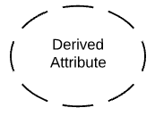
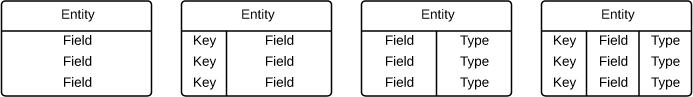
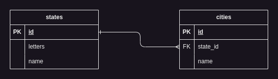

> ## Símbolos e notação do diagrama de Entidade-Relacionamento
>
> 

[](../README.md#jsdevguide "Início")
[](../README.md#summary "Voltar")

> ### *Summary*
>
> - [Símbolos de diagrama ER conceitual](#s%C3%ADmbolos-de-diagrama-er-conceitual "Símbolos de diagrama ER conceitual")
> 	- [Símbolos de entidade ERD](#s%C3%ADmbolos-de-entidade-erd "Símbolos de entidade ERD")
> 	- [Símbolos de relacionamento ERD](#s%C3%ADmbolos-de-relacionamento-erd "Símbolos de relacionamento ERD")
> 	- [Símbolos de atributo ERD](#s%C3%ADmbolos-de-atributo-erd "Símbolos de atributo ERD")
> - [Símbolos do diagrama ER físico](#s%C3%ADmbolos-do-diagrama-er-f%C3%ADsico "Símbolos do diagrama ER físico")
> 	- [Campos](#campos "Campos")
> 	- [Chaves](#chaves "Chaves")
> 		- [Chaves primárias](#chaves-prim%C3%A1rias "Chaves primárias")
> 		- [Chaves estrangeiras](#chaves-estrangeiras "Chaves estrangeiras")
> 	- [Tipos de](#tipos-de "Tipos de")
> - [Diagrama de RE notação](#diagrama-de-re-nota%C3%A7%C3%A3o "Diagrama de RE notação")
> 	- [A Cardinalidade e a ordinalidade](#a-cardinalidade-e-a-ordinalidade "A Cardinalidade e a ordinalidade")
>  - [Exemplos de código para construir bancos de dados relacionados](#exemplos-de-c%C3%B3digo-para-construir-bancos-de-dados-relacionados "Exemplos de código para construir bancos de dados relacionados")
>     - [Modelagem de Relacionamento Um-para-Muitos entre Estados e Cidades em Banco de Dados Relacional](#modelagem-de-relacionamento-um-para-muitos-entre-estados-e-cidades-em-banco-de-dados-relacional "Modelagem de Relacionamento Um-para-Muitos entre Estados e Cidades em Banco de Dados Relacional")
>     - [Alteração de Tabelas para Adicionar Chave Estrangeira e Estabelecer Relacionamento entre Entidades em Banco de Dados](#altera%C3%A7%C3%A3o-de-tabelas-para-adicionar-chave-estrangeira-e-estabelecer-relacionamento-entre-entidades-em-banco-de-dados "Alteração de Tabelas para Adicionar Chave Estrangeira e Estabelecer Relacionamento entre Entidades em Banco de Dados")
>     - [Remoção de Chaves Estrangeiras e Desfazimento de Relacionamentos em Banco de Dados MySQL](#remo%C3%A7%C3%A3o-de-chaves-estrangeiras-e-desfazimento-de-relacionamentos-em-banco-de-dados-mysql "Remoção de Chaves Estrangeiras e Desfazimento de Relacionamentos em Banco de Dados MySQL")
>  - [Guia Completo de Tipos de Atributos em MySQL](#guia-completo-de-tipos-de-atributos-em-mysql "Guia Completo de Tipos de Atributos em MySQL")

## Símbolos de diagrama ER conceitual

Os modelos de dados conceituais estabelecem uma visão ampla do que deve  ser incluído no conjunto de modelos. ERDs conceituais podem ser usados  como base para modelos de dados lógicos. Eles também podem ser usados  para formar relações de comunalidade entre modelos de emergência como  base para a integração do modelo de dados. Todos os símbolos mostrados  abaixo são encontrados na biblioteca de forma de Relacionamento de  Entidade e Entidade Relacionamento de Lucidchart.

### Símbolos de entidade ERD

Entidades são objetos ou conceitos que representam dados importantes. As entidades são tipicamente substantivos, como produto, cliente,  localização ou promoção. Existem três tipos de entidades comumente  usadas em diagramas de relacionamento de entidade.

| Símbolo da Entidade                                          | Nome                 | Descrição do produto Descrição                               |
| ------------------------------------------------------------ | -------------------- | ------------------------------------------------------------ |
|  | Uma entidade forte   | Essas formas são independentes de outras entidades e são  frequentemente chamadas de entidades-mãe, uma vez que muitas vezes têm  entidades fracas que dependem delas. Eles também terão uma chave  primária, distinguindo cada ocorrência da entidade. |
|  | Entidade fraca       | As entidades fracas dependem de outro tipo de entidade. Eles não  têm chaves primárias e não têm significado no diagrama sem sua entidade  controladora. |
|  | Entidade associativa | As entidades associativas  relacionam as instâncias de vários tipos de entidades. Eles também  contêm atributos específicos para a relação entre essas instâncias de  entidade. |

### Símbolos de relacionamento ERD

Dentro dos diagramas de relacionamento de entidades, as relações são  usadas para documentar a interação entre duas entidades. Relacionamentos geralmente são verbos como atribuir, associar ou rastrear e fornecer  informações úteis que não podem ser discernidas apenas com os tipos de  entidade.

| Símbolo do relacionamento                                    | Nome          | Descrição do produto Descrição                               |
| ------------------------------------------------------------ | ------------- | ------------------------------------------------------------ |
|  | Relação       | Relacionamentos são associações entre ou entre entidades.    |
|  | Relação fraca | Relacionamentos fracos são conexões entre uma entidade fraca e seu dono. |

### Símbolos de atributo ERD

Os atributos ERD são características da entidade que ajudam os  usuários a entender melhor o banco de dados. Os atributos são incluídos  para incluir detalhes das várias entidades que são destacadas em um  diagrama conceitual.

| Símbolo de atributo                                          | Nome                     | Descrição do produto Descrição                               |
| ------------------------------------------------------------ | ------------------------ | ------------------------------------------------------------ |
|  | Atributo                 | Os atributos são características de uma entidade, um relacionamento de muitos para muitos ou um relacionamento individual. |
|  | Atributo multivalorizado | Atributos multivalorizados são aqueles que podem assumir mais de um valor. |
|  | Atributo derramado       | Os atributos derivados são atributos cujo valor pode ser calculado a partir de valores de atributos relacionados. |
|  | Relação                  | Relacionamentos são associações entre ou entre entidades.    |

## Símbolos do diagrama ER físico

O modelo de dados físicos é o nível mais granular de diagramas de  relacionamento de entidade e representa o processo de adição de  informações ao banco de dados. Os modelos ER físicos mostram todas as  estruturas da tabela, incluindo o nome da coluna, o tipo de dados da  coluna, as restrições da coluna, a chave primária, a chave estrangeira e as relações entre tabelas.

Como mostrado abaixo, as tabelas são outra maneira de representar  entidades. As partes principais das tabelas de entidades-relacionamento  são:

### Campos

Os campos representam a parte de uma tabela que estabelece os  atributos da entidade. Os atributos são tipicamente pensados como  colunas no banco de dados que o ERD modela.


Na imagem acima, InterestRate e LoanAmount são ambos atributos da entidade que estão contidas como campos.

### Chaves

As chaves são uma maneira de categorizar atributos. Os diagramas de  ER ajudam os usuários a modelar seus bancos de dados usando várias  tabelas que garantem que o banco de dados seja organizado, eficiente e  rápido. As chaves são usadas para vincular várias tabelas em um banco de dados umas às outras da maneira mais eficiente possível.

#### Chaves primárias

As chaves primárias são um atributo ou combinação de atributos que  identificam exclusivamente uma e apenas uma instância de uma entidade.

#### Chaves estrangeiras

Chaves estrangeiras são criadas sempre que um atributo se relaciona  com outra entidade em um relacionamento um-para-um ou um-para-muitos.


Cada carro só pode ser financiado por um banco, portanto, o banco  principal da tabela do Banco é usado como a chave estrangeira FinancedBy na tabela Carro.  Este BankID é capaz de ser usado como a chave  estrangeira para vários carros.

### Tipos de

Os tipos referem-se ao tipo de dados no campo correspondente em uma  tabela. Os tipos também podem se referir a tipos de entidade, que  descrevem a composição de uma entidade; por exemplo, os tipos de  entidade de um livro são autor, título e data publicados.



## Diagrama de RE notação

Embora a notação de pé de corvo seja frequentemente reconhecida como o estilo  mais intuitivo, alguns usam a notação OMT, IDEF, Bachman ou UML, de  acordo com suas preferências. A notação do pé do Crow, no entanto, tem  um formato gráfico intuitivo, tornando-se a notação preferida de ERD  para o Lucidchart.

### A Cardinalidade e a ordinalidade

Cardinalidade refere-se ao número máximo de vezes que uma instância  em uma entidade pode se relacionar com instâncias de outra entidade. A  ordinadalidade, por outro lado, é o número mínimo de vezes que uma  instância em uma entidade pode ser associada a uma instância na entidade relacionada.

Carcarinalidade e ordinalidade são mostradas pelo estilo de uma linha e seu ponto final, de acordo com o estilo de notação escolhido.


Aqui está o significado de cada uma das linhas representadas na imagem:

1. **Linha com um traço vertical simples (|)**:
   - **Significado**: Relacionamento **Um-para-um (1:1)**.
   - **Descrição**: Cada instância de uma entidade está associada a exatamente uma instância da outra entidade. 
   - **Exemplo**: Cada pessoa tem exatamente um número de segurança social.

2. **Linha com "pé de galinha" (\|<)**:
   - **Significado**: Relacionamento **Um-para-muitos (1:N)**.
   - **Descrição**: Uma instância de uma entidade pode estar associada a várias instâncias da outra entidade.
   - **Exemplo**: Um autor pode escrever muitos livros.

3. **Linha com dois traços verticais (||)**:
   - **Significado**: Relacionamento **Um (e somente um)**.
   - **Descrição**: Indica que a entidade associada deve ter exatamente uma instância correspondente, sem possibilidade de variação.
   - **Exemplo**: Cada carro tem exatamente um número de chassi.

4. **Linha com um círculo seguido de um traço vertical (O|)**:
   - **Significado**: Relacionamento **Zero ou um (0:1)**.
   - **Descrição**: Uma entidade pode não ter nenhuma instância relacionada ou pode ter uma única instância relacionada.
   - **Exemplo**: Uma pessoa pode ou não ter um carro.

5. **Linha com "pé de galinha" e um traço vertical (\|<) seguida de um círculo (O)**:
   - **Significado**: Relacionamento **Um ou muitos (1:N)**.
   - **Descrição**: Uma instância de uma entidade pode estar relacionada a uma ou várias instâncias de outra entidade.
   - **Exemplo**: Um cliente pode fazer uma ou várias compras.

6. **Linha com "pé de galinha" (\|<) seguida de um círculo (O)**:
   - **Significado**: Relacionamento **Zero ou muitos (0:N)**.
   - **Descrição**: Uma entidade pode não ter nenhuma instância relacionada ou pode ter muitas instâncias relacionadas.
   - **Exemplo**: Um autor pode não ter escrito nenhum livro ou pode ter escrito muitos.

Essas notações ajudam a definir claramente as regras de cardinalidade nos relacionamentos entre entidades em um diagrama ER, esclarecendo como os dados em diferentes tabelas estão conectados e quais são as restrições ou possibilidades para essas conexões.

[](../README.md#jsdevguide "Início")
[](../README.md#summary "Voltar")
[](#summary "Subir")

---

## Exemplos de código para construir bancos de dados relacionados

### Modelagem de Relacionamento Um-para-Muitos entre Estados e Cidades em Banco de Dados Relacional



```sql
-- Criando a tabela states
CREATE TABLE states (
    id INT AUTO_INCREMENT PRIMARY KEY,
    letters VARCHAR(2) NOT NULL,
    name VARCHAR(100) NOT NULL
);

-- Criando a tabela cities
CREATE TABLE cities (
    id INT AUTO_INCREMENT PRIMARY KEY,
    state_id INT NOT NULL,
    name VARCHAR(100) NOT NULL,
    FOREIGN KEY (state_id) REFERENCES states(id)
);
```

O modelo de Entidade-Relacionamento (ER) descrito pelo código SQL consiste em duas entidades principais: **Estados (states)** e **Cidades (cities)**, com um relacionamento do tipo **um-para-muitos** entre elas. Vamos detalhar cada parte:

### Entidades:

1. **states (Estados)**
   - **Atributos:**
     - `id`: Identificador único do estado, do tipo `INT`, que é auto incrementado (`AUTO_INCREMENT`), sendo também a **chave primária** da tabela.
     - `letters`: Código de duas letras que representam o estado, do tipo `VARCHAR(2)`, que não pode ser nulo (`NOT NULL`). Normalmente representa a sigla do estado.
     - `name`: Nome completo do estado, do tipo `VARCHAR(100)`, também não nulo.
   
   Esta entidade representa a tabela de **Estados**, armazenando o nome completo e a sigla de cada estado.

2. **cities (Cidades)**
   - **Atributos:**
     - `id`: Identificador único da cidade, do tipo `INT`, auto incrementado, sendo também a **chave primária** da tabela.
     - `state_id`: Chave estrangeira (`FOREIGN KEY`) que referencia a tabela `states`, mais especificamente o atributo `id`, garantindo que toda cidade esteja associada a um estado existente.
     - `name`: Nome da cidade, do tipo `VARCHAR(100)`, e também não nulo.

   Esta entidade representa a tabela de **Cidades**, que inclui o nome da cidade e uma chave estrangeira que a vincula ao estado correspondente.

### Relacionamento:

- O relacionamento entre **states** e **cities** é **um-para-muitos** (1:N), onde **um estado pode ter muitas cidades**, mas **cada cidade pertence a um único estado**. Esse relacionamento é implementado através da **chave estrangeira** `state_id` na tabela `cities`, que referencia a chave primária `id` da tabela `states`.

### Resumo:
- **Entidade 1 (states)**: Representa os estados, com atributos para a sigla (`letters`) e o nome (`name`).
- **Entidade 2 (cities)**: Representa as cidades, com atributos para o nome (`name`) e uma chave estrangeira (`state_id`) que relaciona cada cidade a um estado.
- **Relacionamento**: Um estado pode ter muitas cidades, mas cada cidade está associada a um único estado, caracterizando um relacionamento **um-para-muitos**.

Este modelo é simples e adequado para sistemas que precisam armazenar informações sobre cidades e seus estados de origem, como em um sistema de cadastros ou geolocalização.

[](../README.md#jsdevguide "Início")
[](../README.md#summary "Voltar")
[](#summary "Subir")

---

### Alteração de Tabelas para Adicionar Chave Estrangeira e Estabelecer Relacionamento entre Entidades em Banco de Dados

Para criar a relação de **chave estrangeira** entre as tabelas `cities` e `states` após a criação das tabelas, você pode usar o comando `ALTER TABLE`. Esse comando permite modificar uma tabela já existente, adicionando a restrição de chave estrangeira.

Aqui está como você pode fazer isso:

```sql
ALTER TABLE cities
ADD CONSTRAINT fk_state_id
FOREIGN KEY (state_id) REFERENCES states(id);
```

### Explicação:
- **`ALTER TABLE cities`**: Este comando indica que você está modificando a tabela `cities`.
- **`ADD CONSTRAINT fk_state_id`**: Aqui, estamos adicionando uma nova restrição com o nome `fk_state_id`. É uma boa prática nomear as chaves estrangeiras para facilitar o gerenciamento e entendimento.
- **`FOREIGN KEY (state_id)`**: Especifica o campo que será a chave estrangeira, no caso, o atributo `state_id` da tabela `cities`.
- **`REFERENCES states(id)`**: Define que a chave estrangeira `state_id` faz referência ao campo `id` da tabela `states`.

Esse comando criará o relacionamento **um-para-muitos** entre as tabelas `cities` e `states`, garantindo que todas as cidades cadastradas tenham um estado correspondente na tabela `states`.

[](../README.md#jsdevguide "Início")
[](../README.md#summary "Voltar")
[](#summary "Subir")

---

### Remoção de Chaves Estrangeiras e Desfazimento de Relacionamentos em Banco de Dados MySQL

Sim, é possível desfazer o relacionamento entre duas tabelas, removendo a chave estrangeira previamente adicionada. Para isso, você precisa utilizar o comando `ALTER TABLE` para remover a restrição (`CONSTRAINT`) da chave estrangeira. O processo consiste em dois passos:

1. **Descobrir o nome da chave estrangeira (constraint)**: Se você não especificou um nome explícito ao criar a chave estrangeira (como no seu exemplo, onde foi usada `fk_state_id`), o MySQL atribuirá automaticamente um nome para ela. Você pode consultar o nome da chave estrangeira através de uma query nas informações do esquema.

2. **Remover a chave estrangeira**: Uma vez que você tenha o nome da chave estrangeira, pode removê-la.

### Exemplo detalhado:

#### 1. Descobrindo o nome da constraint

Se você não lembra o nome da constraint, pode usar a seguinte consulta para descobrir as chaves estrangeiras em sua tabela:

```sql
SELECT constraint_name 
FROM information_schema.key_column_usage
WHERE table_name = 'cities' AND referenced_table_name = 'states';
```

Isso retornará o nome da chave estrangeira associada à tabela `cities` e à tabela `states`.

#### 2. Removendo a chave estrangeira

Após descobrir o nome da constraint (por exemplo, `fk_state_id`), você pode removê-la com o seguinte comando:

```sql
ALTER TABLE cities
DROP FOREIGN KEY fk_state_id;
```

Se você também quiser remover a coluna `state_id`, que estava vinculada à chave estrangeira, pode adicionar o seguinte comando:

```sql
ALTER TABLE cities
DROP COLUMN state_id;
```

### Resumo:

- Para remover a chave estrangeira, você precisa usar o comando `ALTER TABLE` com `DROP FOREIGN KEY` e fornecer o nome da constraint.
- Se você deseja remover a coluna vinculada à chave estrangeira, você pode usar o comando `DROP COLUMN`.
  
Isso efetivamente "desfaz" o relacionamento entre as duas tabelas.

[](../README.md#jsdevguide "Início")
[](../README.md#summary "Voltar")
[](#summary "Subir")

---

## Guia Completo de Tipos de Atributos em MySQL

Aqui está uma explicação detalhada sobre cada parte do código da tabela MySQL, destacando o uso de diversos tipos de atributos:

```sql
CREATE TABLE exemplo_atributos (
    id INT AUTO_INCREMENT PRIMARY KEY,       -- Inteiro com auto incremento
    nome VARCHAR(100) NOT NULL,              -- String com tamanho variável
    descricao TEXT,                          -- Texto longo
    preco DECIMAL(10, 2),                    -- Número decimal com precisão
    quantidade INT DEFAULT 0,                -- Inteiro com valor padrão
    data_criacao DATE,                       -- Data (apenas data)
    horario TIME,                            -- Hora (apenas hora)
    data_hora DATETIME,                      -- Data e hora
    data_atualizacao TIMESTAMP DEFAULT CURRENT_TIMESTAMP ON UPDATE CURRENT_TIMESTAMP, -- Timestamp com atualização automática
    status ENUM('ativo', 'inativo', 'pendente'), -- Enumeração de valores
    ip_address BINARY(16),                   -- Endereço IP armazenado como binário
    arquivo BLOB,                            -- Blob para armazenar arquivos binários
    email CHAR(50),                          -- String de comprimento fixo
    ativo BOOLEAN,                           -- Valor booleano
    UNIQUE (email),                          -- Exemplo de chave única
    INDEX(nome)                              -- Exemplo de índice em uma coluna
);
```

### Explicação detalhada:

1. **`id INT AUTO_INCREMENT PRIMARY KEY`**:
   - O tipo `INT` define que a coluna `id` será um número inteiro.
   - `AUTO_INCREMENT` define que o valor será automaticamente incrementado cada vez que uma nova linha for inserida, garantindo que cada `id` seja único.
   - `PRIMARY KEY` faz dessa coluna a chave primária da tabela, ou seja, um identificador único para cada registro.

2. **`nome VARCHAR(100) NOT NULL`**:
   - `VARCHAR(100)` define uma string com tamanho variável até 100 caracteres. 
   - `NOT NULL` assegura que a coluna `nome` não pode conter valores nulos, ou seja, sempre deve ter um valor.

3. **`descricao TEXT`**:
   - O tipo `TEXT` é usado para armazenar textos de tamanho longo, geralmente maior que `VARCHAR` e sem limite de caracteres específicos.

4. **`preco DECIMAL(10, 2)`**:
   - O tipo `DECIMAL(10, 2)` é utilizado para números com casas decimais, onde o número pode ter até 10 dígitos no total, sendo 2 após o ponto decimal (ex.: 12345678.99). Isso é útil para valores monetários ou outros valores com precisão decimal.

5. **`quantidade INT DEFAULT 0`**:
   - Define uma coluna `INT` (inteiro) para armazenar a quantidade de algum item. 
   - `DEFAULT 0` define que, caso nenhum valor seja fornecido na inserção de um registro, o valor padrão será `0`.

6. **`data_criacao DATE`**:
   - O tipo `DATE` armazena apenas a data, no formato `YYYY-MM-DD` (ex.: 2024-09-17). É útil quando você precisa armazenar apenas a data, sem hora.

7. **`horario TIME`**:
   - O tipo `TIME` armazena apenas a hora, no formato `HH:MM:SS` (ex.: 14:30:00). Útil para representar horários.

8. **`data_hora DATETIME`**:
   - O tipo `DATETIME` armazena tanto a data quanto a hora, no formato `YYYY-MM-DD HH:MM:SS`. Ideal para registrar eventos que precisam do timestamp completo (ex.: 2024-09-17 14:30:00).

9. **`data_atualizacao TIMESTAMP DEFAULT CURRENT_TIMESTAMP ON UPDATE CURRENT_TIMESTAMP`**:
   - `TIMESTAMP` armazena um carimbo de data e hora.
   - `DEFAULT CURRENT_TIMESTAMP` faz com que o valor padrão da coluna seja a data e hora atuais no momento da inserção do registro.
   - `ON UPDATE CURRENT_TIMESTAMP` atualiza o valor da coluna sempre que o registro for modificado, registrando a última atualização.

10. **`status ENUM('ativo', 'inativo', 'pendente')`**:
    - `ENUM` define uma lista de valores permitidos para essa coluna. Aqui, os valores podem ser 'ativo', 'inativo' ou 'pendente'. Isso é útil quando a coluna deve aceitar um número fixo de valores predefinidos.

11. **`ip_address BINARY(16)`**:
    - `BINARY(16)` armazena dados binários em formato fixo. Nesse exemplo, é usado para armazenar endereços IP no formato binário, o que é útil para representar endereços IPv6 (que têm 16 bytes de comprimento).

12. **`arquivo BLOB`**:
    - O tipo `BLOB` (Binary Large Object) é usado para armazenar grandes quantidades de dados binários, como imagens, vídeos ou outros arquivos.

13. **`email CHAR(50)`**:
    - `CHAR(50)` define uma string de tamanho fixo de 50 caracteres. Diferente do `VARCHAR`, o `CHAR` sempre armazena exatamente 50 caracteres, preenchendo o restante com espaços, se necessário.

14. **`ativo BOOLEAN`**:
    - `BOOLEAN` armazena um valor booleano, que pode ser `TRUE` ou `FALSE`. Alguns bancos de dados implementam o `BOOLEAN` como `TINYINT(1)`, onde `0` é `FALSE` e `1` é `TRUE`.

15. **`UNIQUE (email)`**:
    - Define que a coluna `email` deve ter valores únicos em todos os registros da tabela, ou seja, não pode haver dois registros com o mesmo valor de email.

16. **`INDEX(nome)`**:
    - Cria um índice na coluna `nome` para acelerar as consultas que usam essa coluna em suas cláusulas `WHERE`. Índices são usados para melhorar a performance de consultas em colunas frequentemente buscadas.


Exemplo abrangente de diferentes tipos de colunas e seus atributos no MySQL, útil para referências rápidas e bem documentadas.

[](../README.md#jsdevguide "Início")
[](../README.md#summary "Voltar")
[](#summary "Subir")

---

